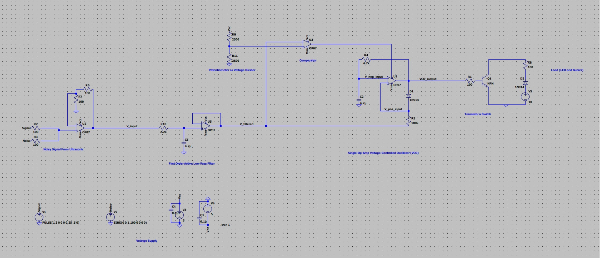

# Ultrasonic Reverse Sensor with Audible and Visual Distance Detector

**Authors:**
- Avvienash Jaganathan
- Ahmed Al-Aidaroos

## Table of Contents

1. [Inspiration](#1-inspiration)
2. [Abstract](#2-abstract)
3. [Input Signal](#3-input-signal)
4. [Circuit Design and Implementation](#4-circuit-design-and-implementation)
   - [4.1 1st Order Active Low-Pass Filter](#41-1st-order-active-low-pass-filter)
   - [4.2 Comparator](#42-comparator)
   - [4.3 Single-Op-Amp Voltage-Controlled Oscillator (VCO)](#43-single-op-amp-voltage-controlled-oscillator-vco)
   - [4.4 Transistor as switch](#44-transistor-as-switch)
5. [Component Analysis](#5-component-analysis)
6. [References](#6-references)

## 1. Inspiration

Reversing is a critical manoeuvre during vehicle operation. The Monash University Accident Research Centre (MUARC) conducted a study in 2014 on "Camera Effectiveness and Back-over Collisions with Pedestrians: A Feasibility Study" [1]. The study revealed that vehicles equipped with advanced reverse sensing technology are less likely to be involved in back-over collisions with pedestrians and cyclists.

The problem that inspired us for this project is that we recognized the limitations of solely relying on rear-view mirrors when reversing in a vehicle, as well as the hazards of blind spots while reversing. Hence, our objective is to enhance driver situational awareness and reduce the likelihood of collisions by designing an Audible and Visual Distance Detection System.

## 2. Abstract

This project report presents the design and implementation details of an Audible and Visual Distance Detector.

The objective of the project is to detect the presence of objects when reversing a vehicle. Then, if the object detected is within a tunable range, the system will produce a pulsing beep with a frequency that increases as the distance to the object decreases.

The report includes a thorough explanation of each circuit block, design considerations, component values, simulation results, measurement results, a comparison between the two, and a cost analysis.

## 3. Input Signal

The input signal is obtained by utilizing an ultrasonic sensor to provide a voltage signal corresponding to the measured distance. The input signal ranges from 0 to 4 volts, corresponding to 0 to 0.5 meters. The voltage-to-distance mapping is based on sensor characteristics [2] and the desired range for demo purposes.

## 4. Circuit Design and Implementation

### 4.1 1st Order Active Low-Pass Filter

#### 4.1.1 Function of Low-Pass Filter

The decision to utilize a First Order Active Low-Pass filter was motivated by its simplicity and cost-effectiveness. This filter type offers an uncomplicated design that consists of a single reactive component, a 4.7µF capacitor, and one resistive element, a 2200 Ω resistor. Given that the input signal is in the range of 0 to 4 volts, there is no need for signal amplification as the clipping voltage of the operational amplifier is already at 5 volts. However, an active low-pass filter that consists of an operational amplifier was chosen rather than a passive one due to its several advantages in terms of signal conditioning and noise reduction.

An active low-pass filter has a higher input impedance than a passive filter, which means that it will not load the input signal and will provide a more accurate representation of the original signal.

#### 4.1.2 Circuit Analysis

The low cut-off frequency can be determined by the formula, 𝑓 = 1 / (2𝜋𝑅𝐶). After evaluating various options and testing multiple times, we determined that utilizing a resistor with a value of 270 Ω and a capacitor with a value of 4.7µF would yield a cut-off frequency of 125Hz.

The active low-pass filter effectively removes high-frequency noise from the input signal.

### 4.2 Comparator

The comparator compares the filtered ultrasonic signal with a threshold value. If the signal is below the threshold, it indicates that the object is within the detection range, and the output triggers the VCO. The threshold signal is controlled by a 5kΩ potentiometer, allowing the range of the ultrasonic sensor to be adjusted. 
The comparator effectively determines when an object is within the detection range.

### 4.3 Single-Op-Amp Voltage-Controlled Oscillator (VCO)

The VCO is responsible for generating an oscillating square waveform output, whose frequency is dependent on the filtered input signal. The frequency of the VCO output is dependent on the charging and discharging of a capacitor based on the input voltage. The VCO output varies linearly with the input voltage.

### 4.4 Transistor as Switch

The transistor is used to control the on/off state of a load (LED and buzzer) based on the VCO output.

### 5. Component Analysis

The table below shows the component analysis, cost, and power consumption:

| Component       | Model                      | Cost   | Peak Power (mW) | Average Power (mW) |
|-----------------|----------------------------|--------|------------------|----------------------|
| R1              | Complex due to internal components | -      | 2.42             | 0.02                 |
| R2              | -                          | $0.60  | 2.13             | 2.97                 |
| R3              | -                          | $0.55  | 2.32             | 2.07                 |
| R4              | -                          | $0.60  | 0.03             | 0.07                 |
| R5              | -                          | $0.60  | 0.04             | 0.01                 |
| R6              | -                          | $1.90  | 0.00             | 0.00                 |
| C5/C2           | P = 0                      | $2.37  | 0.00             | 0.00                 |
| 3x LM741CN Op-Amps | -                        | $3.74  | -                | -                    |
| **Total**       | -                          | **$10.36** | **13.06**       | **6.95**             |

### 6. References

- [Camera Effectiveness and Back-over Collisions with Pedestrians: A Feasibility Study](https://www.monash.edu/muarc/archive/our-publications/reports/muarc321)
- [Ultrasonic ranging module HC - SR04 - SparkFun Electronics](https://cdn.sparkfun.com/datasheets/Sensors/Proximity/HCSR04.pdf)
- [LM741-mil operational amplifier datasheet - Texas Instruments India](https://www.ti.com/lit/ds/symlink/lm741-mil.pdf)
- [LM741 operational amplifier - MIT](https://www.mit.edu/~6.301/LM741.pdf)
- [Summing amplifier is an op-amp voltage adder](https://www.electronicstutorials.ws/opamp/opamp_4.html)
- [Noise test and analysis of automobile engine](https://www.scientific.net/AMM.307.196#:~:text=The%20conclusion%20is%20that%EF%BC%9Athe,noise%20frequency%20mainly%20concentrated%20in)
- [Ultrasonic sensors: Answers to frequently asked questions - Banner Engineering](https://www.bannerengineering.com/my/en/company/expert-insights/ultrasonic-sensors-101.html#/)

Additional information and images can be found in the Project Report.pdf file.
